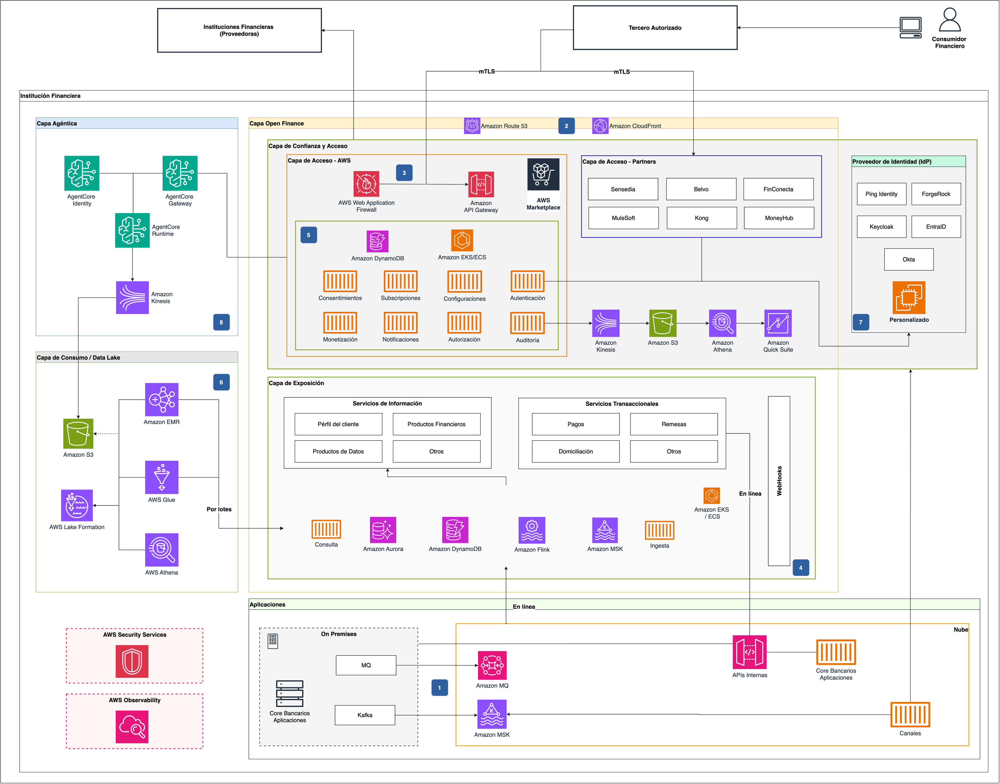
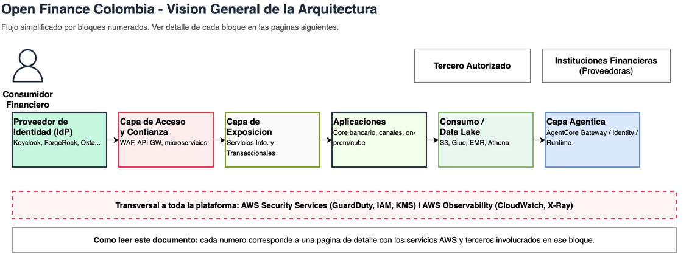
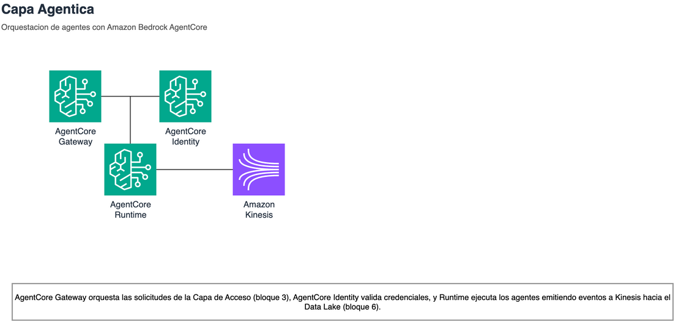
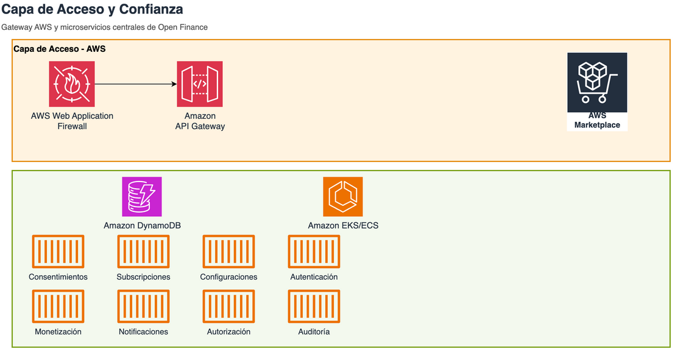
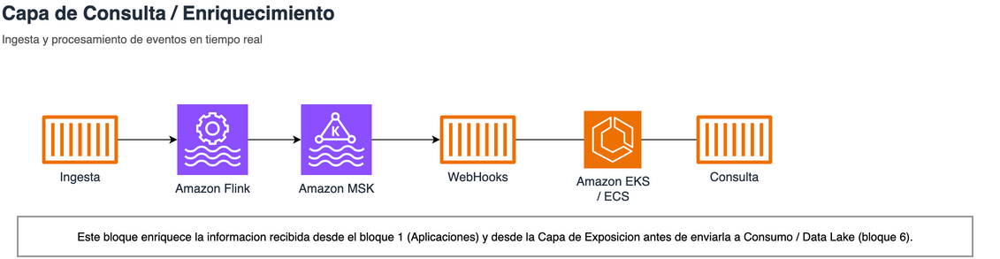
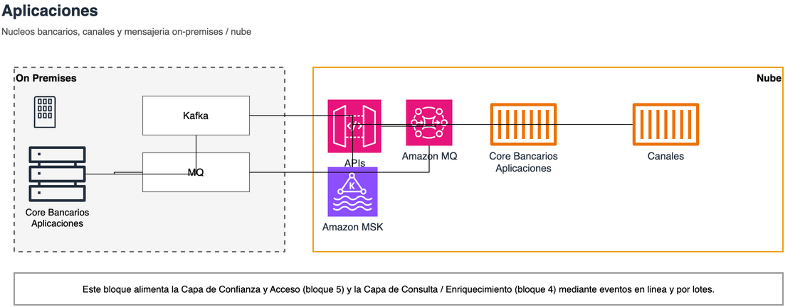
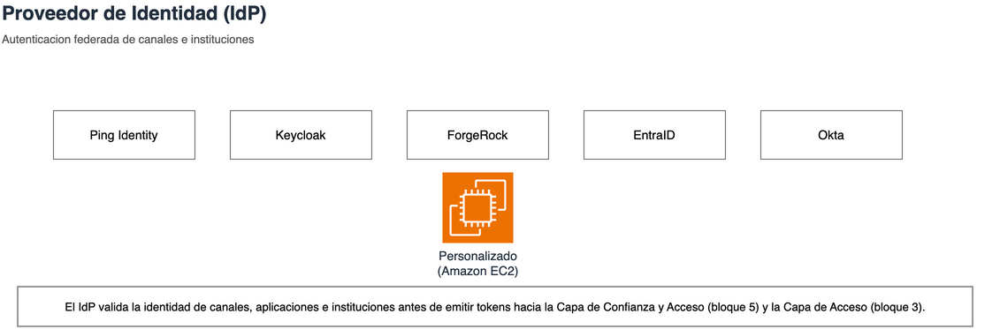
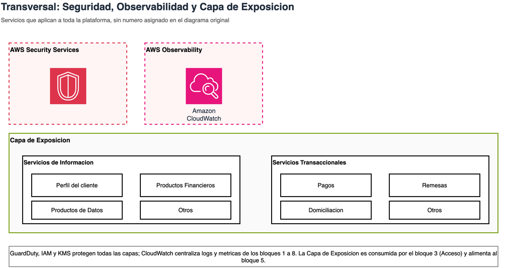
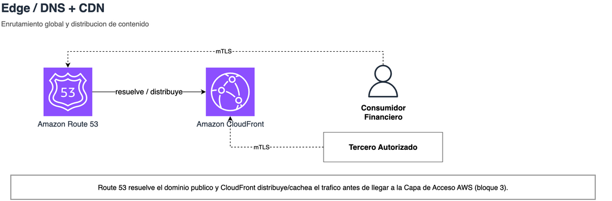
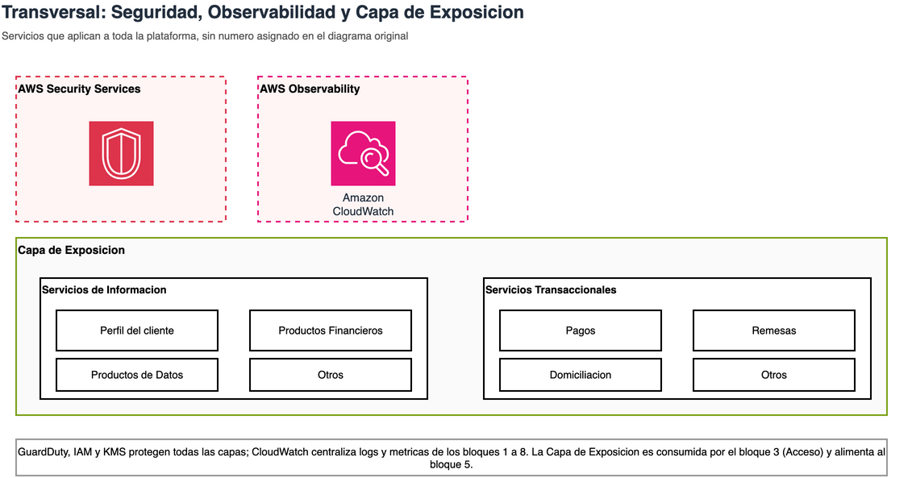

# Arquitectura de Referencia para Open Finance Colombia

Documentación de la arquitectura de referencia para la plataforma de **Open
Finance** (Colombia) sobre AWS. El diagrama original se reorganizó en
bloques y se dividió en páginas individuales para que sea legible
tanto en pantalla como en PDF/eBook.

## Contenido

- [Arquitectura consolidada](#arquitectura-consolidada)
- [Cómo leer este documento](#cómo-leer-este-documento)
- [Visión general](#0--visión-general)
- [Detalle por bloque](#detalle-por-bloque)
 - [Proveedor de Identidad (IdP)](#7--proveedor-de-identidad-idp)
 - [Capa de Acceso y Confianza](#3--capa-de-acceso-y-confianza)
 - [Capa de Exposición](#4--capa-de-exposición)
 - [Aplicaciones](#1--aplicaciones)
 - [Capa de Consumo / Data Lake](#6--capa-de-consumo--data-lake)
 - [Capa Agéntica](#8--capa-agéntica)
 - [Edge / DNS + CDN](#2--edge--dns--cdn)
 - [Transversal: Seguridad, Observabilidad y Exposición](#9--transversal-seguridad-observabilidad-y-exposición)

## Arquitectura consolidada

Este es el diagrama completo del que parte todo el desglose de
este documento. Contiene todos los bloques, servicios e integraciones en
una sola vista.

### Descripción general del flujo

Las siguientes secciones toman este mismo diagrama y lo separan en partes temáticas, agrupadas según los bloques que ya existían en la arquitectura consolidada.

## Cómo leer este documento

Cada sección de detalle describe los servicios de AWS y terceros
involucrados en ese componente. Los bloques de **Seguridad**, **Observabilidad** y la
**Capa de Exposición** son transversales: aplican a todo el sistema y no
tienen una sección separada en el diagrama original, por eso se documentan
aparte como bloque transversal.

## Visión General

Vista simplificada mostrando el flujo, sin el detalle de iconos AWS.
Úsala como mapa de navegación antes de entrar al detalle de cada bloque.

## Detalle por bloque

**Flujo de Acción:** un cliente accede a la aplicación de tercero receptor de
datos y otorga su consentimiento al tercero para acceder a los datos del
cliente o realizar algún tipo de transacción monetaria.

La entidad vigilada en su capa de confianza y acceso se encarga de:
 - Autenticar al cliente, autorizar determinadas operaciones y configuraciones para el tercero receptor de datos y almacenar este consentimiento.
 - Gestionar el token asociado a la relación entre tercero receptor de datos y consentimiento.
 - Gestionar el ciclo de vida del consentimiento del cliente, enviar notificaciones sobre estos eventos y auditarlos.
 - Monitorear y monetizar el consumo por parte de los terceros receptores de datos.

### Proveedor de Identidad (IdP)

Autenticación federada de canales e instituciones.

| Proveedor | Tipo |
|---|---|
| Ping Identity | Third-party IdP |
| Keycloak | Third-party IdP (open source) |
| ForgeRock | Third-party IdP |
| EntraID (Microsoft) | Third-party IdP |
| Okta | Third-party IdP |
| Personalizado (Amazon EC2) | IdP propietario auto-gestionado |

**Descripción:** emite tokens consumidos por la Capa de Confianza y Acceso y la Capa de Acceso.

### Capa de Acceso y Confianza

**Capa de Acceso - AWS**

| Componente | Tipo | Descripción |
|---|---|---|
| AWS WAF | AWS | Protección perimetral (Web Application Firewall) |
| Amazon API Gateway | AWS | Gateway de APIs administrado |
| AWS Marketplace | AWS | Distribución de soluciones de partners |

**Capa de Confianza y Acceso**

| Microservicio | Propósito |
|---|---|
| Consentimientos | Gestión del ciclo de vida del consentimiento del usuario |
| Subscripciones | Suscripción de terceros a productos de datos |
| Configuraciones | Parámetros de negocio y de la plataforma |
| Autenticación | Validación de identidad de los actores |
| Autorización | Control de acceso basado en políticas/scopes |
| Auditoría | Trazabilidad de operaciones sensibles |
| Monetización | Facturación y cobros por uso de APIs |
| Notificaciones | Alertas y eventos hacia consumidores |

| Almacenamiento / Cómputo | Descripción |
|---|---|
| Amazon DynamoDB | Base de datos NoSQL de baja latencia |
| Amazon EKS / ECS | Cómputo de los microservicios |

**Flujo de Acción:** la entidad vigilada, en su capa de confianza y acceso, se encarga de:

- Autenticar al cliente, autorizar determinadas operaciones y configuraciones
 para el tercero receptor de datos y almacenar este consentimiento.
- Gestionar el token asociado a la relación entre tercero receptor de datos y
 consentimiento.
- Gestionar el ciclo de vida del consentimiento del cliente, enviar
 notificaciones sobre estos eventos y auditarlos.
- Monitorear y monetizar el consumo por parte de los terceros receptores de
 datos.

### Capa de Exposición

Ingesta y procesamiento de eventos en tiempo real para enriquecer la
información antes de persistirla.

| Componente | Descripción |
|---|---|
| Amazon MSK | Streaming de eventos |
| Amazon Managed Service for Apache Flink | Procesamiento en tiempo real |
| WebHooks | Notificaciones salientes basadas en eventos |
| Amazon EKS / ECS | Cómputo de los servicios de enriquecimiento |

**Flujo de Acción:** la entidad vigilada dispondrá de una capa de exposición de datos y operaciones que está aislada de todos los componentes propios de la operación. En esta capa se tiene lógica para:
 - Exponer servicios de información que acceden a una capa de consulta exclusiva con datos del cliente, sus productos financieros (ejemplo: saldos y movimientos de una cuenta de ahorros) y sus productos de datos (ejemplo: score crediticio) de la entidad vigilada.
 - Exponer servicios transaccionales a terceros receptores de datos. Estos servicios transaccionales se conectan de forma segura con los core bancarios o aplicaciones de la entidad vigilada.
 - Gestionar los webhooks habilitados para operaciones asíncronas.

### Aplicaciones

Núcleos bancarios, canales y mensajería, tanto on-premises como en la nube.

| Componente | Descripción |
|---|---|
| Core Bancario / Aplicaciones | Sistemas transaccionales on-premises |
| Kafka / Amazon MSK | Bus de eventos on-prem y en la nube |
| MQ / Amazon MQ | Mensajería tradicional |
| APIs Internas | Exposición interna hacia la nube |
| Canales | Canales digitales y físicos de la institución |

**Flujo de Acción:** corresponde a las aplicaciones de la entidad vigilada que
están alojadas en sus centros de cómputo y a los componentes de integración
usados para alimentar la capa de exposición de datos.

### Capa de Consumo / Data Lake

Almacenamiento analítico, catálogo de datos y motor de consultas.

| Componente | Descripción |
|---|---|
| Amazon S3 | Data lake (raw/curated) |
| AWS Lake Formation | Gobierno y catálogo de datos |
| Amazon EMR | Procesamiento batch a gran escala |
| AWS Glue | ETL y catálogo de metadatos |
| AWS Athena | Consultas SQL serverless |
| Amazon Quick Suite | Visualización y BI |

**Flujo de Acción:**  dentro de la arquitectura de referencia de Open Finance, la
capa de consumo o explotación de datos tiene las siguientes responsabilidades:

- Generar productos de datos y alimentarlos a la capa de exposición de datos
 (por ejemplo: modelo de score crediticio, modelo de confianza).
- Almacenar los datos que la entidad vigilada obtiene de otras entidades
 cuando participa como tercera receptora de datos.

### Capa Agéntica

Orquestación de agentes de IA sobre Amazon Bedrock AgentCore.

| Componente | Descripción |
|---|---|
| AgentCore Gateway | Punto de entrada para invocar agentes |
| AgentCore Identity | Gestión de identidad y credenciales de agentes |
| AgentCore Runtime | Ejecución de los agentes |
| Amazon Kinesis | Streaming de eventos generados por los agentes |

**Flujo de Acción:**  la capa agéntica tiene las siguientes responsabilidades:
- Exponer servicios de Open Finance a agentes que obran por los terceros
 receptores de datos.
- Gestionar el consumo de servicios externos por parte de agentes cuando la
 entidad vigilada obra como tercero receptor de datos.

### Edge / DNS + CDN

Enrutamiento global y distribución de contenido para el tráfico entrante de
consumidores financieros y terceros autorizados.

| Componente | Descripción |
|---|---|
| Amazon Route 53 | Resolución DNS pública |
| Amazon CloudFront | Distribución/cache de contenido y APIs |
| mTLS | Autenticación mutua para Terceros Autorizados |

### Transversal: Seguridad, Observabilidad y Exposición

Servicios que aplican a **toda la plataforma**, como capa transversal.

| Categoría | Componentes | Descripción |
|---|---|---|
| Seguridad | AWS Security Services (GuardDuty, IAM, KMS) | Protección, control de acceso y cifrado |
| Observabilidad | Amazon CloudWatch, AWS X-Ray | Logs, métricas y trazas centralizadas |

