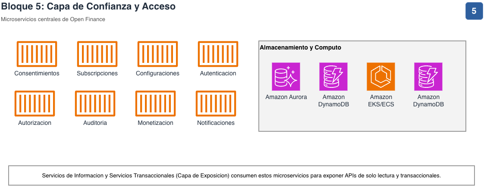

# Arquitectura de Referencia para Open Finance Colombia

Documentación de la arquitectura de referencia para la plataforma de **Open
Finance** (Colombia) sobre AWS. El diagrama original se reorganizó en
bloques numerados y se dividió en páginas individuales para que sea legible
tanto en pantalla como en PDF/eBook.

## Contenido

- [Arquitectura consolidada](#arquitectura-consolidada)
- [Cómo leer este documento](#cómo-leer-este-documento)
- [Visión general](#0--visión-general)
- [Detalle por bloque](#detalle-por-bloque)
  1. [Aplicaciones](#1--aplicaciones)
  2. [Edge / DNS + CDN](#2--edge--dns--cdn)
  3. [Capa de Acceso](#3--capa-de-acceso)
  4. [Capa de Consulta / Enriquecimiento](#4--capa-de-consulta--enriquecimiento)
  5. [Capa de Confianza y Acceso](#5--capa-de-confianza-y-acceso)
  6. [Capa de Consumo / Data Lake](#6--capa-de-consumo--data-lake)
  7. [Proveedor de Identidad (IdP)](#7--proveedor-de-identidad-idp)
  8. [Capa Agéntica](#8--capa-agéntica)
  9. [Transversal: Seguridad, Observabilidad y Exposición](#9--transversal-seguridad-observabilidad-y-exposición)

## Arquitectura consolidada

Este es el diagrama original y completo del que parte todo el desglose de
este documento. Contiene todos los bloques, servicios e integraciones en
una sola vista.


Las siguientes secciones toman este mismo diagrama y lo separan en 10
páginas legibles (una visión general + 9 de detalle), agrupadas según los
bloques numerados que ya existían en la arquitectura consolidada.

## Cómo leer este documento

Cada número (1-8) representa un bloque funcional de la arquitectura y tiene
su propia sección de detalle, con los servicios de AWS y terceros
involucrados. Los bloques de **Seguridad**, **Observabilidad** y la
**Capa de Exposición** son transversales: aplican a todo el sistema y no
tienen un número asignado en el diagrama original, por eso se documentan
aparte (bloque 9).

El flujo general de la plataforma es:

```
Aplicaciones (1) → Edge/DNS+CDN (2) → Capa de Acceso (3)
   → Capa de Confianza y Acceso (5) → Capa de Exposición
   → Consulta/Enriquecimiento (4) → Consumo/Data Lake (6)
```

Con dos componentes de soporte que interactúan de forma transversal:

- **Proveedor de Identidad (7)**: autentica canales, aplicaciones e
  instituciones antes de que lleguen a la Capa de Confianza (5) y a la
  Capa de Acceso (3).
- **Capa Agéntica (8)**: orquesta agentes (Amazon Bedrock AgentCore) que
  son invocados desde la Capa de Acceso (3) y emiten eventos hacia el
  Data Lake (6).

## 0 · Visión General


Vista simplificada de los 8 bloques y su flujo, sin el detalle de iconos AWS.
Úsala como mapa de navegación antes de entrar al detalle de cada bloque.

## Detalle por bloque

### 1 · Aplicaciones


Núcleos bancarios, canales y mensajería, tanto on-premises como en la nube.

| Componente | Descripción |
|---|---|
| Core Bancario / Aplicaciones | Sistemas transaccionales on-premises |
| Kafka / Amazon MSK | Bus de eventos on-prem y en la nube |
| MQ / Amazon MQ | Mensajería tradicional |
| APIs Internas | Exposición interna hacia la nube |
| Canales | Canales digitales y físicos de la institución |

**Conecta con:** alimenta la Capa de Confianza y Acceso (5) y la Capa de
Consulta / Enriquecimiento (4) mediante eventos en línea y por lotes.

### 2 · Edge / DNS + CDN


Enrutamiento global y distribución de contenido para el tráfico entrante de
consumidores financieros y terceros autorizados.

| Componente | Descripción |
|---|---|
| Amazon Route 53 | Resolución DNS pública |
| Amazon CloudFront | Distribución/cache de contenido y APIs |
| mTLS | Autenticación mutua para Terceros Autorizados |

**Conecta con:** enruta el tráfico hacia la Capa de Acceso AWS (3).

### 3 · Capa de Acceso


Gateway de AWS y plataformas de gestión de API de partners/terceros.

| Componente | Tipo | Descripción |
|---|---|---|
| AWS WAF | AWS | Protección perimetral (Web Application Firewall) |
| Amazon API Gateway | AWS | Gateway de APIs administrado |
| Amazon EKS / ECS | AWS | Cómputo de los backends de API |
| MuleSoft, Kong, Sensedia | Partner | Gestión de APIs de terceros |
| Belvo, MoneyHub, FinConecta | Partner | Agregadores / Open Finance providers |
| AWS Marketplace | AWS | Distribución de soluciones de partners |

**Conecta con:** expone las APIs de Open Finance hacia la Capa de Confianza
y Acceso (5); también invoca la Capa Agéntica (8).

### 4 · Capa de Consulta / Enriquecimiento


Ingesta y procesamiento de eventos en tiempo real para enriquecer la
información antes de persistirla.

| Componente | Descripción |
|---|---|
| Amazon MSK | Streaming de eventos |
| Amazon Managed Service for Apache Flink | Procesamiento en tiempo real |
| WebHooks | Notificaciones salientes basadas en eventos |
| Amazon EKS / ECS | Cómputo de los servicios de enriquecimiento |

**Conecta con:** recibe datos del bloque 1 (Aplicaciones) y de la Capa de
Exposición; envía los resultados a Consumo / Data Lake (6).

### 5 · Capa de Confianza y Acceso



Microservicios centrales de Open Finance.

| Microservicio | Propósito |
|---|---|
| Consentimientos | Gestión del ciclo de vida del consentimiento del usuario |
| Subscripciones | Suscripción de terceros a productos de datos |
| Configuraciones | Parámetros de negocio y de la plataforma |
| Autenticación | Validación de identidad de los actores |
| Autorización | Control de acceso basado en políticas/scopes |
| Auditoría | Trazabilidad de operaciones sensibles |
| Monetización | Facturación y cobros por uso de APIs |
| Notificaciones | Alertas y eventos hacia consumidores |

| Almacenamiento / Cómputo | Descripción |
|---|---|
| Amazon Aurora | Base de datos relacional transaccional |
| Amazon DynamoDB | Base de datos NoSQL de baja latencia |
| Amazon EKS / ECS | Cómputo de los microservicios |

**Conecta con:** es consumida por la Capa de Exposición (Servicios de
Información y Transaccionales) y autentica contra el Proveedor de
Identidad (7).

### 6 · Capa de Consumo / Data Lake


Almacenamiento analítico, catálogo de datos y motor de consultas.

| Componente | Descripción |
|---|---|
| Amazon S3 | Data lake (raw/curated) |
| AWS Lake Formation | Gobierno y catálogo de datos |
| Amazon EMR | Procesamiento batch a gran escala |
| AWS Glue | ETL y catálogo de metadatos |
| AWS Athena | Consultas SQL serverless |
| Amazon Quick Suite | Visualización y BI |

**Conecta con:** recibe datos en línea (webhooks) y por lotes (EMR/Glue)
desde el bloque 4; expone resultados vía Athena y Quick Suite.

### 7 · Proveedor de Identidad (IdP)


Autenticación federada de canales e instituciones.

| Proveedor | Tipo |
|---|---|
| Ping Identity | Third-party IdP |
| Keycloak | Third-party IdP (open source) |
| ForgeRock | Third-party IdP |
| EntraID (Microsoft) | Third-party IdP |
| Okta | Third-party IdP |
| Personalizado (Amazon EC2) | IdP propietario auto-gestionado |

**Conecta con:** emite tokens consumidos por la Capa de Confianza y Acceso
(5) y la Capa de Acceso (3).

### 8 · Capa Agéntica


Orquestación de agentes de IA sobre Amazon Bedrock AgentCore.

| Componente | Descripción |
|---|---|
| AgentCore Gateway | Punto de entrada para invocar agentes |
| AgentCore Identity | Gestión de identidad y credenciales de agentes |
| AgentCore Runtime | Ejecución de los agentes |
| Amazon Kinesis | Streaming de eventos generados por los agentes |

**Conecta con:** es invocada desde la Capa de Acceso (3) y envía eventos a
la Capa de Consumo / Data Lake (6) vía Kinesis.

### 9 · Transversal: Seguridad, Observabilidad y Exposición


Servicios que aplican a **toda la plataforma** (bloques 1 a 8), sin número
asignado en el diagrama original.

| Categoría | Componentes | Descripción |
|---|---|---|
| Seguridad | AWS Security Services (GuardDuty, IAM, KMS) | Protección, control de acceso y cifrado |
| Observabilidad | Amazon CloudWatch, AWS X-Ray | Logs, métricas y trazas centralizadas |

**Capa de Exposición** (agrupa los servicios consumidos por la Capa de
Acceso):

| Grupo | Servicios expuestos |
|---|---|
| Servicios de Información | Perfil del cliente, Productos Financieros, Productos de Datos, Otros |
| Servicios Transaccionales | Pagos, Remesas, Domiciliación, Otros |
